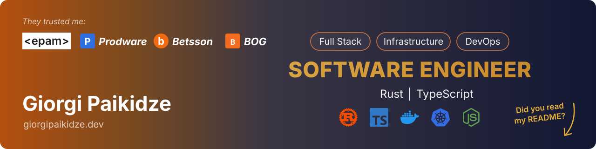

<p align="center">
  
</p>

<div align="center">

# 👋 Hi, I'm Giorgi

### Backend Rust Engineer | Full Stack Developer | Performance Obsessed

_Building fast, memory-safe backends in Rust and the polished frontends that sit on top of them_

[](https://linkedin.com/in/giorgi-paikidze)
[](https://giorgipaikidze.dev)
[](mailto:grgpaikidze@gmail.com)

[](https://github.com/grgpk)

</div>

---

## 🚀 About Me

With **5 years of experience** as a Full Stack Developer & Rust Engineer, I build backend services that are fast, safe and predictable under load, and frontends that make complex systems feel simple. I'm comfortable across the entire stack, with Rust, Axum and Tokio on the server and TypeScript, React and Angular in the browser.

```rust
let grgpk = Engineer {
    role: "Backend Rust Engineer & Full Stack Developer",
    experience: "5+ years",
    focus: "High-performance backends in Rust, polished frontends in TypeScript",
    focus_of_expertise: vec![
        "Rust ownership, borrowing & lifetimes",
        "Async Rust with Tokio",
        "Axum APIs & PostgreSQL",
        "Performance optimization",
        "React & Angular",
    ],
    open_to_collaborate: true,
};
```

### 💡 What Sets Me Apart

- 🦀 **Backend Mastery**: Deep expertise in Rust ownership & async, building production APIs with Axum, Tokio and SQLx
- 🔒 **Ownership Rules Guru**: Borrowing, lifetimes and `Send`/`Sync` puzzles that make the compiler work for me, not against me
- ⚡ **Performance-Driven**: Obsessed with latency, throughput, allocations and query plans, both on the server and in the browser
- 🌉 **Full-Stack Perspective**: Strong frontend skills in React and Angular complement backend expertise for complete solution architecture

---

## 🛠️ Tech Stack

### Backend


### Frontend


---

## ⭐ Some of My Favorite Projects

<p align="center">
  <a href="https://github.com/grgpk/cadence">
    
  </a>
</p>

<p align="center"><b>Cadence</b>: scheduling & call-booking app. Rust / Axum / Tokio / SQLx / Postgres backend with a DDD layout, and a React + TanStack frontend with types generated straight from Rust via <code>ts-rs</code>.</p>

---

## 🦀 Rust Stats

<p align="center">
  <a href="https://github.com/grgpk/rust-task-manager">
    
  </a>
  <a href="https://github.com/grgpk/signer-api">
    
  </a>
  <a href="https://github.com/grgpk/sentinel">
    
  </a>
  <a href="https://github.com/grgpk/rust-projects">
    
  </a>
</p>

---

## 🤝 Let's Collaborate!

I'm always interested in:

- 🦀 Backend services in Rust where latency and reliability matter
- ⚡ Performance work: profiling, cutting allocations, tuning queries and async runtimes
- 🔁 Migrating hot paths or whole services from Node.js to Rust
- 🌐 Open source contributions in the Rust ecosystem (Axum, Tokio, SQLx)
- 💡 Consulting on backend architecture and performance optimization

---

## 📫 How to Reach Me

- 💼 **LinkedIn:** [LinkedIn Profile](https://linkedin.com/in/giorgi-paikidze)
- 🌐 **Portfolio:** [giorgipaikidze.dev](https://giorgipaikidze.dev)
- 📧 **Email:** grgpaikidze@gmail.com

---

## 🎯 Core Competencies

```rust
let skills = Skills {
    backend: Backend {
        languages: vec!["Rust", "SQL"],
        async_runtime: vec!["Tokio"],
        frameworks: vec!["Axum"],
        data: vec!["PostgreSQL", "SQLx", "Database Design"],
        architecture: vec!["RESTful APIs", "Domain-Driven Design", "Microservices"],
        concepts: vec!["Ownership & Borrowing", "Lifetimes", "Async/Await", "Concurrency"],
        tooling: vec!["Cargo", "Docker"],
    },
    frontend: Frontend {
        languages: vec!["TypeScript"],
        frameworks: vec!["React", "Angular"],
    },
    priorities: vec![
        "Performance Optimization",
        "Low Latency & High Throughput",
        "Memory Efficiency",
        "Zero-Cost Abstractions",
        "Profiling & Benchmarking",
    ],
};
```

---

<div align="center">

### 🌟 "Fast, safe, and correct, one commit at a time."

[](https://github.com/grgpk)
[](https://github.com/grgpk)

**Thanks for visiting! Feel free to explore my repositories and reach out for collaboration opportunities.** 🚀

</div>
